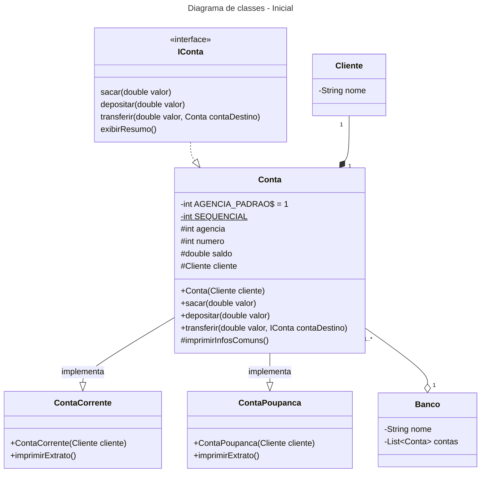
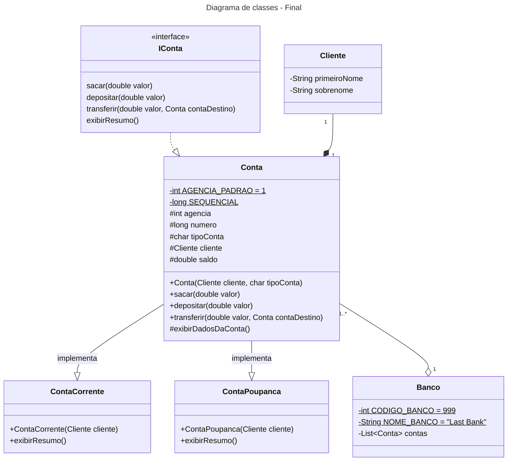
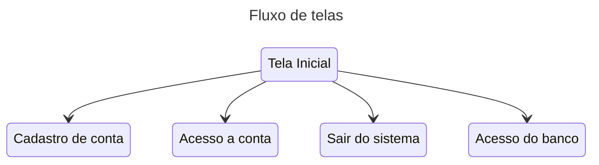

# DIO-BancoDigital

## Resolução do Desafio "Criando um Banco Digital com Java e Orientação a Objetos"
Repositório do desafio ["DIO - Criando um Banco Digital com Java e Orientação a Objetos"](https://github.com/falvojr/lab-banco-digital-oo) por [Venilton Falvo Jr](https://github.com/falvojr]).

## Domínio / Problema

Considerando nosso conhecimento no domínio bancário, iremos abstrair uma solução Orientada a Objetos em Java.

Para isso, vamos interpretar o seguinte cenário:
“Um banco oferece aos seus clientes dois tipos de contas (corrente e poupança), as quais possuem as funcionalidades de depósito, saque e transferência (entre contas da própria instituição).”

## Desafio de Projeto

Agora é a sua hora de brilhar, use todo seu conhecimento em Java e Orientação a Objetos para evoluir o projeto criado nesta aula.

Para isso, seguem algumas sugestões:
- Use todo o seu conhecimento para estender o domínio, incluindo novas classes, atributos e/ou métodos;
- Incluir o Lombok ao projeto para reduzir sua verbosidade de código.

